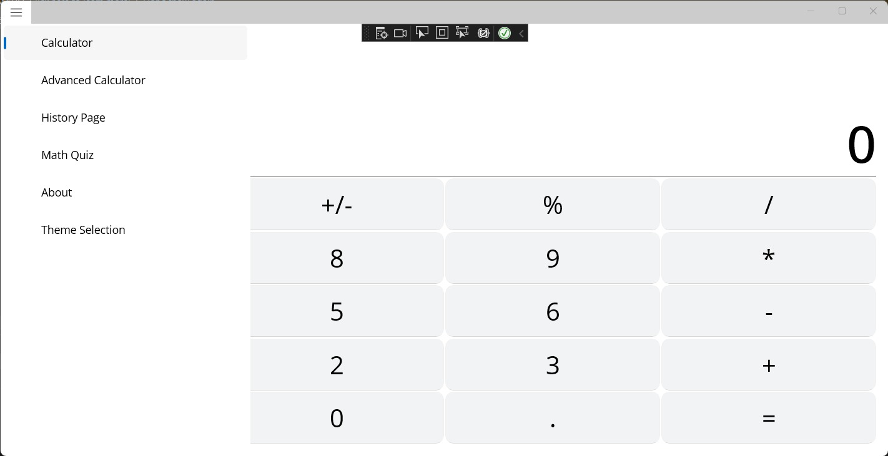
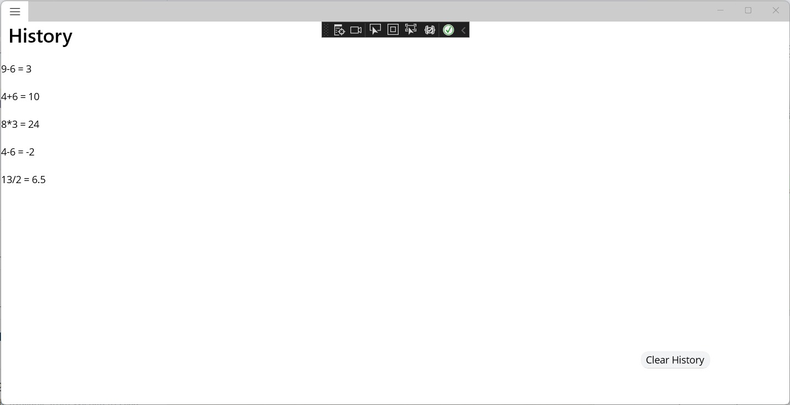
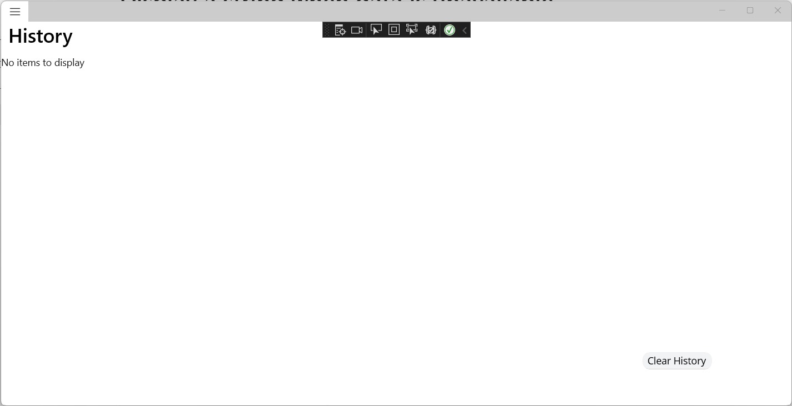
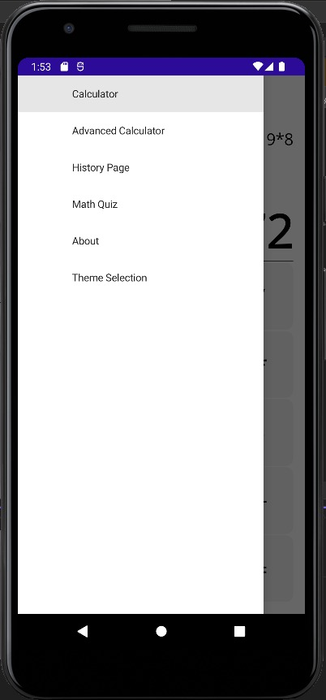
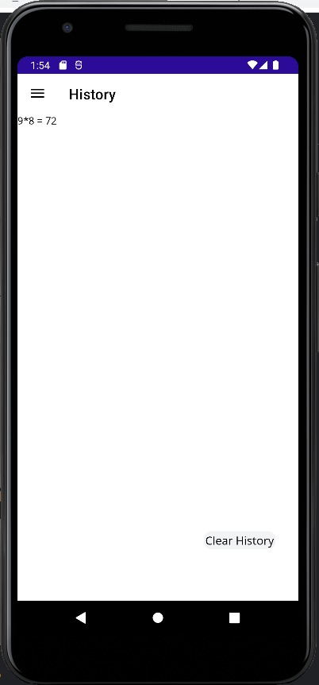
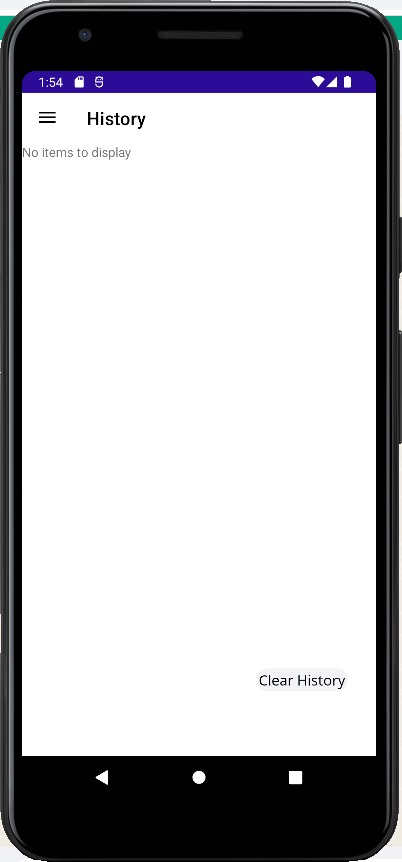

# Cross Platform Project 4
Names:  
Rohith Yanapu WSU ID:A499S235  GitHub ID - #110309836
Prudhvi Reddy Mali WSU ID:Y943Z365  GitHub ID - #90169754
Jithu Project WSU ID:A592S722  GitHub ID - #114536052

COMMITS:  

ROHITH  

1. Commit Description - Code for Views cleaned
    Commit Id - 319506f2cb5f7ffc0ba52b893a63a56a614b79d3

2. Commit Description - Added History Page and List View  
    Commit Id - 5b6cf12fd8e4339098d3fa24bbe73dab0ad3d1c8

3. Commit Description - Added Model for Database
Commit Id - c0ce5aa45a45f1c1d82c1595a7d27c76dbdced1f

PRUDHVI  

1. Commit Description - Added Nuget Packages and Database file
Commit Id -  27e3c32c8a2a341118f46488590db0b3f1b4d9cc

2. Commit Description - Added Insert Funtion  
Commit Id -  448a274cc9755418934f1fd09336e3b342abb80d

3. Commit Description - Added Retreiving and Delete all functions
Commit Id - 3ac684665e7317ab062d7a4e39cd6e6861e6fd09

JITENDER  

1. Commit Description - Added Deleting and Retreiving functions
Commit Id - c97fbdce720335ada74c6eb2daac921541ce3770

2. Commit Description - Added DatabaseConnection to Files
Commit Id - 2f274e60cf2537abb1548ac8dc9d35f3ebd0163b

3. Commit Description - Added functionality to add data
Commit Id - 915be175aa9f872eac509a0009a2006b497a1bc5

## YouTube Link
[Demo Video](https://youtu.be/1-8pMgyZxXw)

## Application Output Images
### Desktop Images
Desktop Image 1

Desktop Image 2

Desktop Image 3

### Andriod Images
Android Image 1

Android Image 2

Android Image 3

